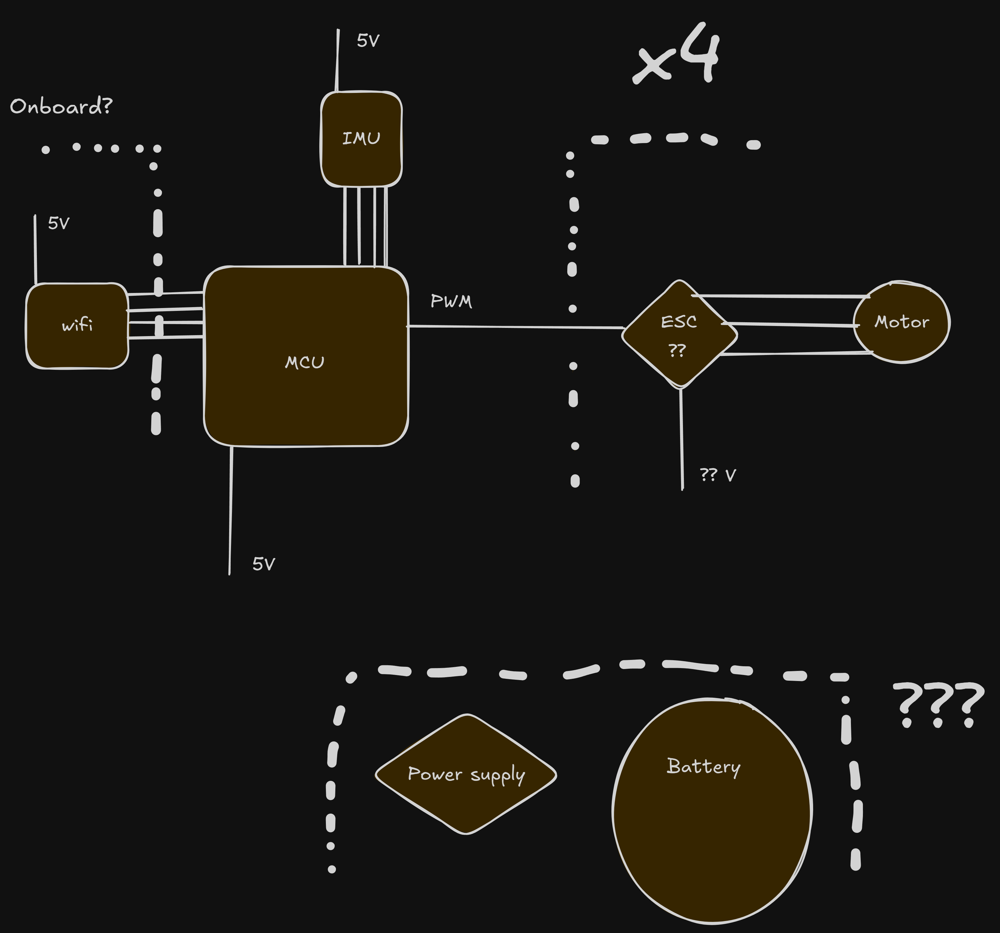

# DroneAlpha
Drone Project(WIP)

Using STM32F406VGT

## Some info:

Electronics looks like this at this point

* Still need to figure out which battery, and power supply to use, and how to get power to all the parts. Have a motor picked out but that may need to change
